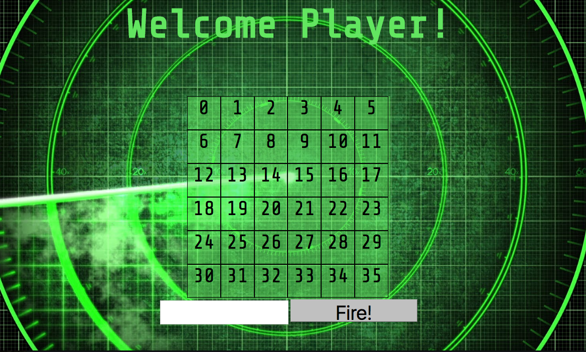

# Battleship!

Currently, a one-player game, testing your abilities to hunt and sink ships of various sizes before you run out of missles! Future updates will include a two-player mode, scoring, and more!

## Code structure

Three class constructors:

  Cell
     Parameters:
       boatOrNot -> true or false
     Interfaces:
       play() -> marks cell as played
       isExplosion() -> return true or false, based on IF the cell has an explosion
       isSplash() -> return ture or false, based on IF the cell has splashed

  Board
    Parameters:
      width, height
    Interfaces:
      buildBoard -> builds board based on random cell placement
                    future version will include random ship placement
      guess(cellId) -> play cell
      isGameOver -> checks to see if the boat cells have been exploded
                 -> returns true/false

  BoardView
        Parameters:
          domBoard, board
        Interfaces:
          render() -> creates board and sets attributes (classes, ids, innerHTML)
          displayGameOver() -> eventually, will display when a player has sunk all boats

## Authors
        - Josh Whitney www.github.com/joshlw04

#PS :
I've also created a Magic 8 Ball 'game', which I'm adding to my Battleship directory. I made it to help me practice, and I think it looks good enough to add here. It was relatively easy, but it helped me practice making classes and tying them together. 
